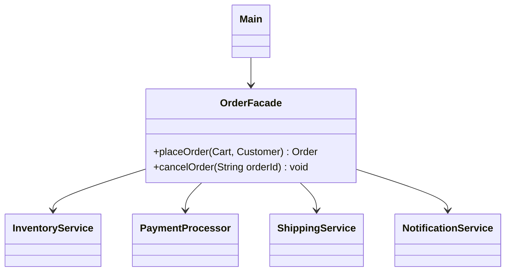

# UML class diagram

```mermaid
classDiagram
    class OrderFacade {
        +placeOrder(Cart, Customer) Order
        +cancelOrder(String orderId) void
    }
    class InventoryService
    class PaymentProcessor
    class ShippingService
    class NotificationService
    Main --> OrderFacade
    OrderFacade --> InventoryService
    OrderFacade --> PaymentProcessor
    OrderFacade --> ShippingService
    OrderFacade --> NotificationService
```

Subsystem classes have no reference back to the facade.
